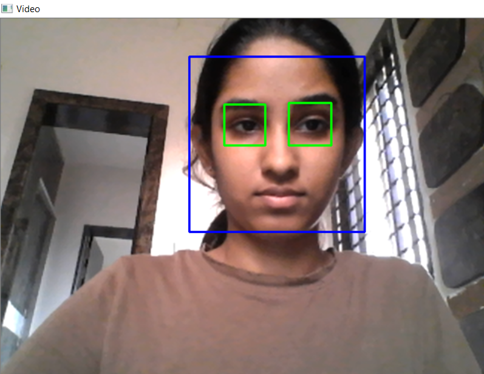

# Facial-Detection-Using-OpenCV_and_Python
A simple project to detect face and eyes using Haar cascade classifier.

## Requirements
OpenCV: opencv-4.4.0

Python 3: python 3.8.5

Spyder Anaconda IDE (Optional)

Haar Cascade Classifier Files

## Output

